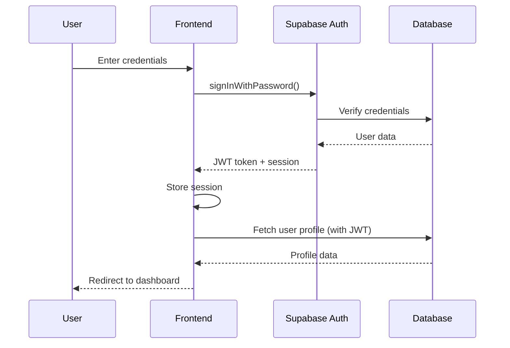

# Design Document

## Overview

Fantooo is a production-ready, enterprise-grade fantasy chat platform built with Next.js 14, TypeScript, Supabase (PostgreSQL), and Tailwind CSS. The architecture prioritizes scalability, security, real-time performance, and maintainability. The system supports three distinct user types (real users, operators, admins) with role-based access control, real-time messaging, intelligent operator assignment, dynamic pricing, payment processing, and comprehensive audit trails.

The platform uses a modern tech stack optimized for serverless deployment on Vercel with Supabase handling database, authentication, real-time subscriptions, and edge functions. The design emphasizes transaction safety, race condition prevention, GDPR compliance, and production-grade error handling.

## Architecture

### High-Level Architecture

```
┌─────────────────────────────────────────────────────────────────┐
│                         Client Layer                             │
│  ┌──────────────┐  ┌──────────────┐  ┌──────────────┐          │
│  │ User Web App │  │ Operator App │  │  Admin Panel │          │
│  │  (Next.js)   │  │  (Next.js)   │  │  (Next.js)   │          │
│  └──────────────┘  └──────────────┘  └──────────────┘          │
└─────────────────────────────────────────────────────────────────┘
                              │
                              ▼
┌─────────────────────────────────────────────────────────────────┐
│                      API & Real-time Layer                       │
│  ┌──────────────────────────────────────────────────────────┐  │
│  │              Supabase (Backend as a Service)              │  │
│  │  • REST API          • Real-time Subscriptions            │  │
│  │  • Authentication    • Row Level Security                 │  │
│  └──────────────────────────────────────────────────────────┘  │
└─────────────────────────────────────────────────────────────────┘
                              │
                              ▼
┌─────────────────────────────────────────────────────────────────┐
│                      Business Logic Layer                        │
│  ┌──────────────────────────────────────────────────────────┐  │
│  │                   Edge Functions                          │  │
│  │  • Payment Processing    • Account Deletion               │  │
│  │  • Chat Auto-Close       • Payment Reconciliation         │  │
│  │  • Chat Escalation       • Admin Bootstrap                │  │
│  └──────────────────────────────────────────────────────────┘  │
└─────────────────────────────────────────────────────────────────┘
                              │
                              ▼
┌─────────────────────────────────────────────────────────────────┐
│                        Data Layer                                │
│  ┌──────────────────────────────────────────────────────────┐  │
│  │         PostgreSQL Database (Supabase)                    │  │
│  │  • Partitioned Tables    • Triggers & Functions           │  │
│  │  • Materialized Views    • Full-Text Search               │  │
│  │  • Audit Tables          • RLS Policies                   │  │
│  └──────────────────────────────────────────────────────────┘  │
└─────────────────────────────────────────────────────────────────┘
                              │
                              ▼
┌─────────────────────────────────────────────────────────────────┐
│                    External Services                             │
│  ┌──────────────┐  ┌──────────────┐  ┌──────────────┐          │
│  │   Paystack   │  │ Google Maps  │  │  Cloudflare  │          │
│  │   Payments   │  │  Geocoding   │  │Email Routing │          │
│  └──────────────┘  └──────────────┘  └──────────────┘          │
└─────────────────────────────────────────────────────────────────┘
```

### Technology Stack

**Frontend:**
- Next.js 14 (App Router)
- React 18
- TypeScript
- Tailwind CSS (Custom glassmorphism design system)
- Zustand (State management)
- React Query (Server state)

**Backend:**
- Supabase (PostgreSQL 15+)
- Supabase Auth (JWT-based)
- Supabase Realtime (WebSocket)
- Supabase Edge Functions (Deno runtime)

**External Services:**
- Paystack (Payment processing)
- Google Maps API (Geocoding)
- Cloudflare Email Routing (Email forwarding)

**Deployment:**
- Vercel (Frontend hosting)
- Supabase Cloud (Backend infrastructure)


## Components and Interfaces

### Frontend Application Structure

```
fantooo/
├── app/
│   ├── (public)/
│   │   ├── page.tsx                    # Landing page (/)
│   │   ├── get-started/
│   │   │   └── page.tsx                # Onboarding flow
│   │   ├── op-login/
│   │   │   └── page.tsx                # Operator login (hidden)
│   │   └── admin-login/
│   │       └── page.tsx                # Admin login (hidden)
│   ├── (auth)/
│   │   └── setup/
│   │       └── page.tsx                # First admin setup
│   ├── (user)/
│   │   ├── discover/
│   │   │   └── page.tsx                # Browse fictional profiles
│   │   ├── profile/[id]/
│   │   │   └── page.tsx                # View fictional profile
│   │   ├── chat/[chatId]/
│   │   │   └── page.tsx                # User chat interface
│   │   ├── favorites/
│   │   │   └── page.tsx                # Favorited profiles
│   │   ├── me/
│   │   │   └── page.tsx                # User profile settings
│   │   └── credits/
│   │       └── page.tsx                # Purchase credits
│   ├── (operator)/
│   │   └── operator/
│   │       ├── waiting/
│   │       │   └── page.tsx            # Operator waiting room
│   │       ├── chat/[chatId]/
│   │       │   └── page.tsx            # Operator chat interface
│   │       ├── stats/
│   │       │   └── page.tsx            # Operator performance
│   │       └── settings/
│   │           └── page.tsx            # Operator settings
│   └── (admin)/
│       └── admin/
│           ├── dashboard/
│           │   └── page.tsx            # Admin overview
│           ├── fictional-profiles/
│           │   └── page.tsx            # Manage fictional profiles
│           ├── real-users/
│           │   └── page.tsx            # Manage real users
│           ├── operators/
│           │   └── page.tsx            # Manage operators
│           ├── chats/
│           │   └── page.tsx            # Chat inspection
│           ├── payments/
│           │   └── page.tsx            # Payment reconciliation
│           ├── admins/
│           │   └── page.tsx            # Admin management
│           ├── stats/
│           │   └── page.tsx            # Platform analytics
│           └── settings/
│               └── page.tsx            # System settings
├── components/
│   ├── ui/
│   │   ├── GlassCard.tsx               # Glassmorphism card
│   │   ├── GlassButton.tsx             # Styled button
│   │   ├── GlassInput.tsx              # Form input
│   │   ├── Modal.tsx                   # Modal dialog
│   │   ├── Toast.tsx                   # Notifications
│   │   └── LoadingSpinner.tsx          # Loading state
│   ├── chat/
│   │   ├── ChatInterface.tsx           # Chat UI component
│   │   ├── ChatBubble.tsx              # Message display
│   │   ├── TypingIndicator.tsx         # Typing status
│   │   └── MessageInput.tsx            # Message composer
│   ├── profile/
│   │   ├── ProfileCard.tsx             # Profile display card
│   │   ├── ProfileCarousel.tsx         # Image carousel
│   │   └── ProfileGrid.tsx             # Grid layout
│   ├── operator/
│   │   ├── ThreePanelLayout.tsx        # Operator chat layout
│   │   ├── ProfileNotes.tsx            # Editable notes
│   │   ├── QueueDisplay.tsx            # Assignment queue
│   │   └── AvailabilityToggle.tsx      # Online/offline toggle
│   ├── admin/
│   │   ├── ChatInspector.tsx           # Chat monitoring
│   │   ├── UserManagement.tsx          # User CRUD
│   │   ├── OperatorManagement.tsx      # Operator CRUD
│   │   └── AnalyticsDashboard.tsx      # Stats display
│   └── shared/
│       ├── LocationAutocomplete.tsx    # Location search
│       ├── PaymentModal.tsx            # Paystack integration
│       └── Navigation.tsx              # Role-based nav
├── lib/
│   ├── supabase/
│   │   ├── client.ts                   # Supabase client
│   │   ├── server.ts                   # Server-side client
│   │   └── middleware.ts               # Auth middleware
│   ├── hooks/
│   │   ├── useAuth.ts                  # Authentication hook
│   │   ├── useChat.ts                  # Chat operations
│   │   ├── useRealtime.ts              # Realtime subscriptions
│   │   └── useCredits.ts               # Credit management
│   ├── utils/
│   │   ├── credits.ts                  # Credit calculations
│   │   ├── timezone.ts                 # EAT timezone handling
│   │   ├── validation.ts               # Input validation
│   │   └── formatting.ts               # Data formatting
│   └── types/
│       ├── database.ts                 # Database types
│       ├── user.ts                     # User types
│       └── chat.ts                     # Chat types
└── supabase/
    ├── migrations/
    │   ├── 001_initial_schema.sql      # Core tables
    │   ├── 002_rls_policies.sql        # Security policies
    │   ├── 003_triggers.sql            # Database triggers
    │   └── 004_functions.sql           # Database functions
    └── functions/
        ├── bootstrap-first-admin/
        ├── delete-user-account/
        ├── delete-operator-account/
        ├── process-payment/
        ├── reconcile-payments/
        ├── auto-close-inactive-chats/
        └── escalate-problematic-chats/
```


### Key Component Interfaces

#### ChatInterface Component
```typescript
interface ChatInterfaceProps {
  chatId: string;
  userType: 'real' | 'operator' | 'admin';
  onMessageSent?: (message: Message) => void;
  onCreditInsufficient?: () => void;
}

interface Message {
  id: string;
  chatId: string;
  senderType: 'real' | 'fictional';
  content: string;
  contentType: 'text' | 'image' | 'voice' | 'video' | 'gif';
  creditsCharged: number;
  isFreeMessage: boolean;
  isEdited: boolean;
  createdAt: string;
  status: 'sending' | 'sent' | 'delivered' | 'read' | 'failed';
}
```

#### ProfileCard Component
```typescript
interface ProfileCardProps {
  profile: FictionalUser;
  onChatClick: (profileId: string) => void;
  onFavoriteClick?: (profileId: string) => void;
  isFavorited?: boolean;
  showActions?: boolean;
}

interface FictionalUser {
  id: string;
  name: string;
  age: number;
  gender: string;
  location: string;
  bio: string;
  profilePictures: string[];
  isFeatured: boolean;
  isActive: boolean;
}
```

#### ThreePanelLayout Component (Operator)
```typescript
interface ThreePanelLayoutProps {
  chatId: string;
  realUser: RealUserProfile;
  fictionalUser: FictionalUserProfile;
  messages: Message[];
  onSendMessage: (content: string) => Promise<void>;
  onSaveNotes: (notes: string, type: 'real' | 'fictional') => Promise<void>;
}

interface RealUserProfile {
  id: string;
  username: string;
  displayName: string;
  age: number;
  gender: string;
  location: string;
  profilePicture?: string;
  credits: number;
  userTier: string;
  notes?: string;
}

interface FictionalUserProfile {
  id: string;
  name: string;
  age: number;
  gender: string;
  location: string;
  bio: string;
  profilePictures: string[];
  responseStyle: string;
  personalityGuidelines: string;
  responseTemplates: Record<string, string>;
  notes?: string;
}
```

#### PaymentModal Component
```typescript
interface PaymentModalProps {
  isOpen: boolean;
  onClose: () => void;
  packages: CreditPackage[];
  onPurchaseComplete: (credits: number) => void;
}

interface CreditPackage {
  id: string;
  name: string;
  credits: number;
  price: number;
  currency: string;
  badge?: string;
  discountPercentage?: number;
  bonusCredits: number;
  isFeatured: boolean;
}
```


## Data Models

### Core Database Schema

#### real_users Table
```sql
CREATE TABLE real_users (
  id UUID PRIMARY KEY DEFAULT gen_random_uuid(),
  auth_id UUID REFERENCES auth.users UNIQUE NOT NULL,
  username TEXT UNIQUE NOT NULL,
  display_name TEXT NOT NULL,
  email TEXT UNIQUE NOT NULL,
  age INTEGER NOT NULL CHECK (age >= 18 AND age <= 100),
  gender TEXT NOT NULL CHECK (gender IN ('male', 'female', 'other')),
  looking_for TEXT NOT NULL CHECK (looking_for IN ('male', 'female', 'both')),
  location TEXT NOT NULL,
  latitude DECIMAL(10, 8),
  longitude DECIMAL(11, 8),
  bio TEXT,
  profile_picture TEXT,
  profile_pictures TEXT[],
  credits INTEGER DEFAULT 0 CHECK (credits >= 0),
  total_spent DECIMAL(10, 2) DEFAULT 0,
  user_tier TEXT DEFAULT 'free' CHECK (user_tier IN ('free', 'bronze', 'silver', 'gold', 'platinum')),
  loyalty_points INTEGER DEFAULT 0,
  total_messages_sent INTEGER DEFAULT 0,
  total_chats INTEGER DEFAULT 0,
  favorite_count INTEGER DEFAULT 0,
  last_active_at TIMESTAMP DEFAULT NOW(),
  is_active BOOLEAN DEFAULT true,
  is_verified BOOLEAN DEFAULT false,
  is_banned BOOLEAN DEFAULT false,
  ban_reason TEXT,
  banned_until TIMESTAMP,
  notification_preferences JSONB DEFAULT '{"email": true, "push": true}',
  privacy_settings JSONB DEFAULT '{"show_online": true, "show_location": true}',
  created_at TIMESTAMP DEFAULT NOW(),
  updated_at TIMESTAMP DEFAULT NOW(),
  deleted_at TIMESTAMP
);

CREATE INDEX idx_real_users_auth_id ON real_users(auth_id);
CREATE INDEX idx_real_users_username ON real_users(username);
CREATE INDEX idx_real_users_location ON real_users(location);
CREATE INDEX idx_real_users_tier ON real_users(user_tier);
CREATE INDEX idx_real_users_last_active ON real_users(last_active_at DESC);
```

#### fictional_users Table
```sql
CREATE TABLE fictional_users (
  id UUID PRIMARY KEY DEFAULT gen_random_uuid(),
  name TEXT NOT NULL,
  age INTEGER NOT NULL CHECK (age >= 18 AND age <= 100),
  gender TEXT NOT NULL CHECK (gender IN ('male', 'female', 'other')),
  location TEXT NOT NULL,
  bio TEXT NOT NULL,
  personality_traits TEXT[],
  interests TEXT[],
  occupation TEXT,
  education TEXT,
  relationship_status TEXT,
  profile_pictures TEXT[] NOT NULL CHECK (array_length(profile_pictures, 1) >= 3),
  cover_photo TEXT,
  response_style TEXT CHECK (response_style IN ('flirty', 'romantic', 'friendly', 'intellectual', 'playful')),
  response_templates JSONB,
  personality_guidelines TEXT,
  total_chats INTEGER DEFAULT 0,
  total_messages INTEGER DEFAULT 0,
  average_rating DECIMAL(3, 2) DEFAULT 0,
  total_revenue DECIMAL(10, 2) DEFAULT 0,
  conversion_rate DECIMAL(5, 2) DEFAULT 0,
  is_active BOOLEAN DEFAULT true,
  is_featured BOOLEAN DEFAULT false,
  featured_until TIMESTAMP,
  max_concurrent_chats INTEGER DEFAULT 10,
  tags TEXT[],
  category TEXT,
  popularity_score INTEGER DEFAULT 0,
  created_by UUID REFERENCES admins(id),
  created_at TIMESTAMP DEFAULT NOW(),
  updated_at TIMESTAMP DEFAULT NOW(),
  deleted_at TIMESTAMP,
  CONSTRAINT valid_profile_pictures CHECK (
    array_length(profile_pictures, 1) >= 3 AND
    array_length(profile_pictures, 1) <= 10
  )
);

CREATE INDEX idx_fictional_gender ON fictional_users(gender);
CREATE INDEX idx_fictional_active ON fictional_users(is_active) WHERE deleted_at IS NULL;
CREATE INDEX idx_fictional_featured ON fictional_users(is_featured, featured_until);
CREATE INDEX idx_fictional_popularity ON fictional_users(popularity_score DESC);
CREATE INDEX idx_fictional_tags ON fictional_users USING GIN(tags);
```

#### chats Table
```sql
CREATE TABLE chats (
  id UUID PRIMARY KEY DEFAULT gen_random_uuid(),
  real_user_id UUID REFERENCES real_users(id) NOT NULL,
  fictional_user_id UUID REFERENCES fictional_users(id) NOT NULL,
  assigned_operator_id UUID REFERENCES operators(id),
  assignment_time TIMESTAMP,
  last_operator_activity TIMESTAMP,
  assignment_count INTEGER DEFAULT 0,
  status TEXT DEFAULT 'active' CHECK (status IN ('active', 'idle', 'closed', 'archived', 'escalated')),
  close_reason TEXT,
  message_count INTEGER DEFAULT 0,
  free_messages_used INTEGER DEFAULT 0,
  paid_messages_count INTEGER DEFAULT 0,
  total_credits_spent INTEGER DEFAULT 0,
  user_satisfaction_rating INTEGER CHECK (user_satisfaction_rating BETWEEN 1 AND 5),
  operator_notes TEXT,
  admin_notes TEXT,
  flags TEXT[],
  first_message_at TIMESTAMP,
  last_message_at TIMESTAMP,
  last_user_message_at TIMESTAMP,
  last_fictional_message_at TIMESTAMP,
  average_response_time INTERVAL,
  created_at TIMESTAMP DEFAULT NOW(),
  updated_at TIMESTAMP DEFAULT NOW(),
  closed_at TIMESTAMP,
  UNIQUE(real_user_id, fictional_user_id)
);

CREATE INDEX idx_chats_real_user ON chats(real_user_id);
CREATE INDEX idx_chats_fictional_user ON chats(fictional_user_id);
CREATE INDEX idx_chats_operator ON chats(assigned_operator_id);
CREATE INDEX idx_chats_status ON chats(status);
CREATE INDEX idx_chats_last_message ON chats(last_message_at DESC);
CREATE INDEX idx_chats_assignment ON chats(assigned_operator_id, status) WHERE status = 'active';
```

#### messages Table (Partitioned)
```sql
CREATE TABLE messages (
  id UUID PRIMARY KEY DEFAULT gen_random_uuid(),
  chat_id UUID REFERENCES chats(id) NOT NULL,
  sender_type TEXT NOT NULL CHECK (sender_type IN ('real', 'fictional')),
  content TEXT NOT NULL,
  original_content TEXT,
  content_type TEXT DEFAULT 'text' CHECK (content_type IN ('text', 'image', 'voice', 'video', 'gif')),
  media_url TEXT,
  handled_by_operator_id UUID REFERENCES operators(id),
  is_free_message BOOLEAN DEFAULT false,
  credits_charged INTEGER DEFAULT 0,
  is_edited BOOLEAN DEFAULT false,
  edited_by UUID,
  edited_at TIMESTAMP,
  edit_count INTEGER DEFAULT 0,
  status TEXT DEFAULT 'sent' CHECK (status IN ('sending', 'sent', 'delivered', 'read', 'failed')),
  delivered_at TIMESTAMP,
  read_at TIMESTAMP,
  sentiment_score DECIMAL(3, 2),
  toxicity_score DECIMAL(3, 2),
  is_flagged BOOLEAN DEFAULT false,
  flag_reason TEXT,
  created_at TIMESTAMP DEFAULT NOW(),
  updated_at TIMESTAMP,
  deleted_at TIMESTAMP
) PARTITION BY RANGE (created_at);

CREATE INDEX idx_messages_chat ON messages(chat_id, created_at DESC);
CREATE INDEX idx_messages_operator ON messages(handled_by_operator_id);
CREATE INDEX idx_messages_created ON messages(created_at DESC);
```

#### operators Table
```sql
CREATE TABLE operators (
  id UUID PRIMARY KEY DEFAULT gen_random_uuid(),
  auth_id UUID REFERENCES auth.users UNIQUE NOT NULL,
  name TEXT NOT NULL,
  email TEXT UNIQUE NOT NULL,
  specializations TEXT[],
  languages TEXT[] DEFAULT ARRAY['en'],
  skill_level TEXT DEFAULT 'junior' CHECK (skill_level IN ('junior', 'mid', 'senior', 'expert')),
  is_active BOOLEAN DEFAULT true,
  is_available BOOLEAN DEFAULT false,
  max_concurrent_chats INTEGER DEFAULT 5,
  current_chat_count INTEGER DEFAULT 0,
  total_messages_sent INTEGER DEFAULT 0,
  total_chats_handled INTEGER DEFAULT 0,
  average_response_time INTERVAL,
  average_user_rating DECIMAL(3, 2) DEFAULT 0,
  total_ratings INTEGER DEFAULT 0,
  quality_score DECIMAL(5, 2) DEFAULT 100,
  idle_incidents INTEGER DEFAULT 0,
  reassignment_count INTEGER DEFAULT 0,
  user_complaints INTEGER DEFAULT 0,
  quality_threshold DECIMAL(5, 2) DEFAULT 60,
  is_suspended BOOLEAN DEFAULT false,
  suspension_reason TEXT,
  suspended_until TIMESTAMP,
  last_activity TIMESTAMP DEFAULT NOW(),
  last_login TIMESTAMP,
  total_online_time INTERVAL DEFAULT '0',
  hourly_rate DECIMAL(10, 2),
  commission_rate DECIMAL(5, 2),
  total_earnings DECIMAL(10, 2) DEFAULT 0,
  created_by UUID REFERENCES admins(id),
  created_at TIMESTAMP DEFAULT NOW(),
  updated_at TIMESTAMP DEFAULT NOW(),
  deleted_at TIMESTAMP
);

CREATE INDEX idx_operators_available ON operators(is_available, is_active) WHERE deleted_at IS NULL;
CREATE INDEX idx_operators_quality ON operators(quality_score DESC);
CREATE INDEX idx_operators_specializations ON operators USING GIN(specializations);
```

#### admins Table
```sql
CREATE TABLE admins (
  id UUID PRIMARY KEY DEFAULT gen_random_uuid(),
  auth_id UUID REFERENCES auth.users UNIQUE NOT NULL,
  name TEXT NOT NULL,
  email TEXT UNIQUE NOT NULL,
  role TEXT DEFAULT 'admin' CHECK (role IN ('super_admin', 'admin', 'moderator')),
  permissions JSONB DEFAULT '{
    "manage_users": true,
    "manage_fictional_profiles": true,
    "manage_operators": true,
    "manage_chats": true,
    "view_analytics": true,
    "manage_payments": true,
    "manage_admins": false,
    "system_settings": false,
    "delete_data": false
  }',
  is_active BOOLEAN DEFAULT true,
  last_login TIMESTAMP,
  last_activity TIMESTAMP DEFAULT NOW(),
  created_by UUID REFERENCES admins(id),
  created_at TIMESTAMP DEFAULT NOW(),
  updated_at TIMESTAMP DEFAULT NOW(),
  deleted_at TIMESTAMP
);

CREATE INDEX idx_admins_auth ON admins(auth_id);
CREATE INDEX idx_admins_role ON admins(role);
CREATE INDEX idx_admins_active ON admins(is_active) WHERE deleted_at IS NULL;
```

#### transactions Table
```sql
CREATE TABLE transactions (
  id UUID PRIMARY KEY DEFAULT gen_random_uuid(),
  real_user_id UUID REFERENCES real_users(id) NOT NULL,
  type TEXT NOT NULL CHECK (type IN ('purchase', 'refund', 'bonus', 'deduction')),
  amount DECIMAL(10, 2) NOT NULL,
  credits_amount INTEGER NOT NULL,
  payment_provider TEXT DEFAULT 'paystack',
  provider_reference TEXT UNIQUE NOT NULL,
  provider_response JSONB,
  status TEXT DEFAULT 'pending' CHECK (status IN ('pending', 'processing', 'success', 'failed', 'refunded')),
  failure_reason TEXT,
  webhook_received_count INTEGER DEFAULT 0,
  last_webhook_at TIMESTAMP,
  package_id UUID REFERENCES credit_packages(id),
  package_snapshot JSONB,
  promo_code TEXT,
  discount_amount DECIMAL(10, 2) DEFAULT 0,
  needs_manual_review BOOLEAN DEFAULT false,
  review_reason TEXT,
  reviewed_by UUID REFERENCES admins(id),
  reviewed_at TIMESTAMP,
  created_at TIMESTAMP DEFAULT NOW(),
  completed_at TIMESTAMP,
  refunded_at TIMESTAMP
);

CREATE INDEX idx_transactions_user ON transactions(real_user_id, created_at DESC);
CREATE INDEX idx_transactions_status ON transactions(status);
CREATE INDEX idx_transactions_reference ON transactions(provider_reference);
CREATE INDEX idx_transactions_review ON transactions(needs_manual_review) WHERE needs_manual_review = true;
```


### Supporting Tables

#### chat_queue Table
```sql
CREATE TABLE chat_queue (
  id UUID PRIMARY KEY DEFAULT gen_random_uuid(),
  chat_id UUID REFERENCES chats(id) UNIQUE NOT NULL,
  priority TEXT NOT NULL CHECK (priority IN ('urgent', 'high', 'normal', 'low')),
  priority_score INTEGER NOT NULL,
  user_tier TEXT NOT NULL,
  user_lifetime_value DECIMAL(10, 2),
  wait_time INTERVAL,
  required_specializations TEXT[],
  preferred_operator_id UUID REFERENCES operators(id),
  excluded_operator_ids UUID[],
  entered_queue_at TIMESTAMP DEFAULT NOW(),
  attempts INTEGER DEFAULT 0,
  last_attempt_at TIMESTAMP,
  created_at TIMESTAMP DEFAULT NOW()
);

CREATE INDEX idx_queue_priority ON chat_queue(priority_score DESC, entered_queue_at ASC);
CREATE INDEX idx_queue_chat ON chat_queue(chat_id);
```

#### credit_packages Table
```sql
CREATE TABLE credit_packages (
  id UUID PRIMARY KEY DEFAULT gen_random_uuid(),
  name TEXT NOT NULL,
  credits INTEGER NOT NULL,
  price DECIMAL(10, 2) NOT NULL,
  currency TEXT DEFAULT 'KES',
  is_featured BOOLEAN DEFAULT false,
  badge_text TEXT,
  discount_percentage INTEGER,
  bonus_credits INTEGER DEFAULT 0,
  is_active BOOLEAN DEFAULT true,
  valid_from TIMESTAMP DEFAULT NOW(),
  valid_until TIMESTAMP,
  variant TEXT,
  conversion_rate DECIMAL(5, 2),
  created_at TIMESTAMP DEFAULT NOW(),
  updated_at TIMESTAMP DEFAULT NOW()
);
```

#### message_edit_history Table
```sql
CREATE TABLE message_edit_history (
  id UUID PRIMARY KEY DEFAULT gen_random_uuid(),
  message_id UUID NOT NULL,
  original_content TEXT NOT NULL,
  new_content TEXT NOT NULL,
  edited_by UUID NOT NULL,
  editor_type TEXT NOT NULL CHECK (editor_type IN ('admin', 'operator')),
  edit_reason TEXT,
  created_at TIMESTAMP DEFAULT NOW()
);

CREATE INDEX idx_edit_history_message ON message_edit_history(message_id, created_at DESC);
CREATE INDEX idx_edit_history_editor ON message_edit_history(edited_by);
```

#### credit_refunds Table
```sql
CREATE TABLE credit_refunds (
  id UUID PRIMARY KEY DEFAULT gen_random_uuid(),
  user_id UUID REFERENCES real_users(id) NOT NULL,
  amount INTEGER NOT NULL,
  reason TEXT NOT NULL CHECK (reason IN (
    'accidental_send',
    'inappropriate_content',
    'system_error',
    'admin_discretion',
    'account_deletion'
  )),
  message_id UUID REFERENCES messages(id),
  chat_id UUID REFERENCES chats(id),
  processed_by UUID REFERENCES admins(id) NOT NULL,
  notes TEXT,
  status TEXT DEFAULT 'completed' CHECK (status IN ('pending', 'completed', 'rejected')),
  created_at TIMESTAMP DEFAULT NOW()
);

CREATE INDEX idx_refunds_user ON credit_refunds(user_id, created_at DESC);
CREATE INDEX idx_refunds_processor ON credit_refunds(processed_by);
```

#### deleted_users Table
```sql
CREATE TABLE deleted_users (
  id UUID PRIMARY KEY,
  original_user_id UUID NOT NULL,
  username TEXT,
  email TEXT,
  deletion_reason TEXT,
  deletion_requested_at TIMESTAMP,
  deletion_completed_at TIMESTAMP DEFAULT NOW(),
  total_spent DECIMAL(10, 2),
  total_messages_sent INTEGER,
  account_age_days INTEGER,
  data_anonymized BOOLEAN DEFAULT true,
  messages_anonymized BOOLEAN DEFAULT true,
  unused_credits INTEGER,
  refund_amount DECIMAL(10, 2),
  refund_processed BOOLEAN DEFAULT false,
  created_at TIMESTAMP DEFAULT NOW()
);

CREATE INDEX idx_deleted_users_original ON deleted_users(original_user_id);
CREATE INDEX idx_deleted_users_date ON deleted_users(deletion_completed_at DESC);
```

#### banned_users_tracking Table
```sql
CREATE TABLE banned_users_tracking (
  id UUID PRIMARY KEY DEFAULT gen_random_uuid(),
  user_id UUID REFERENCES real_users(id) NOT NULL,
  ban_reason TEXT NOT NULL,
  banned_by UUID REFERENCES admins(id) NOT NULL,
  banned_until TIMESTAMP,
  is_permanent BOOLEAN DEFAULT false,
  ip_addresses INET[],
  device_fingerprints TEXT[],
  email_pattern TEXT,
  circumvention_attempts INTEGER DEFAULT 0,
  last_attempt_at TIMESTAMP,
  created_at TIMESTAMP DEFAULT NOW()
);

CREATE INDEX idx_banned_users ON banned_users_tracking(user_id);
CREATE INDEX idx_banned_ips ON banned_users_tracking USING GIN(ip_addresses);
CREATE INDEX idx_banned_devices ON banned_users_tracking USING GIN(device_fingerprints);
```

#### user_activity_log Table (Partitioned)
```sql
CREATE TABLE user_activity_log (
  id UUID PRIMARY KEY DEFAULT gen_random_uuid(),
  user_id UUID REFERENCES real_users(id) NOT NULL,
  activity_type TEXT NOT NULL,
  entity_type TEXT,
  entity_id UUID,
  metadata JSONB,
  session_id TEXT,
  ip_address INET,
  user_agent TEXT,
  device_fingerprint TEXT,
  created_at TIMESTAMP DEFAULT NOW()
) PARTITION BY RANGE (created_at);

CREATE INDEX idx_activity_user ON user_activity_log(user_id, created_at DESC);
CREATE INDEX idx_activity_type ON user_activity_log(activity_type, created_at DESC);
CREATE INDEX idx_activity_ip ON user_activity_log(ip_address);
CREATE INDEX idx_activity_device ON user_activity_log(device_fingerprint);
```

#### admin_notifications Table
```sql
CREATE TABLE admin_notifications (
  id UUID PRIMARY KEY DEFAULT gen_random_uuid(),
  type TEXT NOT NULL CHECK (type IN (
    'operator_suspended',
    'chat_escalation',
    'payment_failed',
    'high_refund_rate',
    'system_error',
    'security_alert'
  )),
  message TEXT NOT NULL,
  metadata JSONB,
  is_read BOOLEAN DEFAULT false,
  read_by UUID REFERENCES admins(id),
  read_at TIMESTAMP,
  priority TEXT DEFAULT 'normal' CHECK (priority IN ('low', 'normal', 'high', 'critical')),
  created_at TIMESTAMP DEFAULT NOW()
);

CREATE INDEX idx_admin_notifications_unread ON admin_notifications(is_read, created_at DESC) WHERE is_read = false;
CREATE INDEX idx_admin_notifications_priority ON admin_notifications(priority, created_at DESC);
```


## Error Handling

### Error Handling Strategy

The application implements a comprehensive error handling strategy across all layers:

#### Frontend Error Handling

**API Error Handling:**
```typescript
class APIError extends Error {
  constructor(
    public statusCode: number,
    public code: string,
    message: string,
    public details?: any
  ) {
    super(message);
    this.name = 'APIError';
  }
}

async function handleAPICall<T>(
  apiCall: () => Promise<T>,
  errorContext: string
): Promise<T> {
  try {
    return await apiCall();
  } catch (error) {
    if (error instanceof APIError) {
      // Log to monitoring service
      logError(errorContext, error);
      
      // Show user-friendly message
      toast.error(getUserFriendlyMessage(error.code));
      
      throw error;
    }
    
    // Unknown error
    logError(errorContext, error);
    toast.error('An unexpected error occurred. Please try again.');
    throw new APIError(500, 'UNKNOWN_ERROR', 'Unknown error occurred');
  }
}
```

**Credit Insufficient Error:**
```typescript
class InsufficientCreditsError extends Error {
  constructor(
    public required: number,
    public available: number
  ) {
    super(`Need ${required} credits, have ${available}`);
    this.name = 'InsufficientCreditsError';
  }
}

// Usage in chat component
try {
  await sendMessage(content);
} catch (error) {
  if (error instanceof InsufficientCreditsError) {
    showCreditPurchaseModal();
  }
}
```

**Real-time Connection Error:**
```typescript
function useRealtimeConnection(chatId: string) {
  const [connectionState, setConnectionState] = useState<'connected' | 'disconnected' | 'reconnecting'>('disconnected');
  
  useEffect(() => {
    const channel = supabase
      .channel(`chat:${chatId}`)
      .on('postgres_changes', { ... }, handleMessage)
      .subscribe((status) => {
        if (status === 'SUBSCRIBED') {
          setConnectionState('connected');
        } else if (status === 'CLOSED') {
          setConnectionState('disconnected');
          // Attempt reconnection
          setTimeout(() => {
            setConnectionState('reconnecting');
            channel.subscribe();
          }, 3000);
        }
      });
    
    return () => {
      channel.unsubscribe();
    };
  }, [chatId]);
  
  return connectionState;
}
```

#### Backend Error Handling

**Database Transaction Errors:**
```typescript
async function sendMessageWithTransaction(
  chatId: string,
  content: string,
  userId: string
): Promise<Message> {
  const client = await pool.connect();
  
  try {
    await client.query('BEGIN');
    
    // Lock user row
    const userResult = await client.query(
      'SELECT * FROM real_users WHERE id = $1 FOR UPDATE',
      [userId]
    );
    
    if (!userResult.rows[0]) {
      throw new APIError(404, 'USER_NOT_FOUND', 'User not found');
    }
    
    const user = userResult.rows[0];
    const cost = await calculateMessageCost({...});
    
    if (user.credits < cost) {
      throw new InsufficientCreditsError(cost, user.credits);
    }
    
    // Deduct credits
    await client.query(
      'UPDATE real_users SET credits = credits - $1 WHERE id = $2',
      [cost, userId]
    );
    
    // Create message
    const message = await client.query(
      'INSERT INTO messages (...) VALUES (...) RETURNING *',
      [...]
    );
    
    await client.query('COMMIT');
    return message.rows[0];
    
  } catch (error) {
    await client.query('ROLLBACK');
    
    // Log failed transaction
    await logFailedTransaction({
      userId,
      chatId,
      error: error.message,
      timestamp: new Date()
    });
    
    throw error;
  } finally {
    client.release();
  }
}
```

**Edge Function Error Handling:**
```typescript
// Edge Function: process-payment
serve(async (req) => {
  try {
    const payload = await req.json();
    
    // Validate webhook signature
    const signature = req.headers.get('x-paystack-signature');
    if (!verifyWebhookSignature(payload, signature)) {
      return new Response(
        JSON.stringify({ error: 'Invalid signature' }),
        { status: 401, headers: { 'Content-Type': 'application/json' } }
      );
    }
    
    // Process payment
    await processPayment(payload);
    
    return new Response(
      JSON.stringify({ success: true }),
      { headers: { 'Content-Type': 'application/json' } }
    );
    
  } catch (error) {
    // Log error
    console.error('Payment processing error:', error);
    
    // Mark transaction for manual review
    if (error.transactionId) {
      await markForManualReview(error.transactionId, error.message);
    }
    
    // Return 200 to prevent webhook retry
    return new Response(
      JSON.stringify({ 
        success: false, 
        error: 'Payment processing failed',
        requiresManualReview: true 
      }),
      { status: 200, headers: { 'Content-Type': 'application/json' } }
    );
  }
});
```

### Error Categories and Handling

| Error Type | HTTP Code | User Message | Action |
|------------|-----------|--------------|--------|
| InsufficientCredits | 402 | "You need more credits to send this message" | Show purchase modal |
| UserNotFound | 404 | "User not found" | Redirect to login |
| ChatNotFound | 404 | "Chat not found" | Redirect to discover |
| Unauthorized | 401 | "Please log in to continue" | Redirect to login |
| Forbidden | 403 | "You don't have permission" | Show error page |
| ValidationError | 400 | Specific validation message | Highlight field |
| DuplicateChat | 409 | "Chat already exists" | Open existing chat |
| OperatorUnavailable | 503 | "No operators available" | Show waiting message |
| PaymentFailed | 402 | "Payment failed. Please try again" | Retry payment |
| DatabaseError | 500 | "Something went wrong" | Log and notify admin |
| NetworkError | 0 | "Connection lost. Reconnecting..." | Auto-retry |


## Testing Strategy

### Testing Pyramid

```
                    ┌─────────────┐
                    │   E2E Tests │  (10%)
                    │  Playwright │
                    └─────────────┘
                  ┌───────────────────┐
                  │ Integration Tests │  (30%)
                  │  React Testing    │
                  │     Library       │
                  └───────────────────┘
              ┌─────────────────────────────┐
              │      Unit Tests             │  (60%)
              │  Jest + Testing Library     │
              └─────────────────────────────┘
```

### Unit Tests

**Credit Calculation Tests:**
```typescript
describe('calculateMessageCost', () => {
  it('should return 0 for first 3 messages', () => {
    const cost = calculateMessageCost({
      messageNumber: 2,
      timeOfDay: new Date('2024-01-15T10:00:00Z'),
      fictional: { is_featured: false },
      user: { user_tier: 'free' }
    });
    expect(cost).toBe(0);
  });
  
  it('should apply peak hour multiplier', () => {
    const cost = calculateMessageCost({
      messageNumber: 5,
      timeOfDay: new Date('2024-01-15T20:00:00+03:00'), // 8pm EAT
      fictional: { is_featured: false },
      user: { user_tier: 'free' }
    });
    expect(cost).toBe(2); // 1 * 1.2 = 1.2, rounded up to 2
  });
  
  it('should apply featured profile multiplier', () => {
    const cost = calculateMessageCost({
      messageNumber: 5,
      timeOfDay: new Date('2024-01-15T14:00:00+03:00'),
      fictional: { is_featured: true },
      user: { user_tier: 'free' }
    });
    expect(cost).toBe(2); // 1 * 1.5 = 1.5, rounded up to 2
  });
});
```

**Validation Tests:**
```typescript
describe('validateUserRegistration', () => {
  it('should reject age below 18', () => {
    const result = validateUserRegistration({
      username: 'john',
      age: 17,
      location: 'Nairobi'
    });
    expect(result.isValid).toBe(false);
    expect(result.errors.age).toBe('Must be 18 or older');
  });
  
  it('should validate username uniqueness', async () => {
    const result = await checkUsernameAvailability('existinguser');
    expect(result.available).toBe(false);
  });
});
```

### Integration Tests

**Chat Flow Tests:**
```typescript
describe('Chat Integration', () => {
  it('should send message and deduct credits', async () => {
    const { getByRole, getByText } = render(<ChatInterface chatId="test-chat" />);
    
    // Initial credits
    expect(getByText('Credits: 10')).toBeInTheDocument();
    
    // Send message
    const input = getByRole('textbox');
    await userEvent.type(input, 'Hello');
    await userEvent.click(getByRole('button', { name: /send/i }));
    
    // Wait for credit deduction
    await waitFor(() => {
      expect(getByText('Credits: 9')).toBeInTheDocument();
    });
  });
  
  it('should show purchase modal on insufficient credits', async () => {
    const { getByRole, getByText } = render(
      <ChatInterface chatId="test-chat" userCredits={0} />
    );
    
    const input = getByRole('textbox');
    await userEvent.type(input, 'Hello');
    await userEvent.click(getByRole('button', { name: /send/i }));
    
    await waitFor(() => {
      expect(getByText('Purchase Credits')).toBeInTheDocument();
    });
  });
});
```

**Payment Flow Tests:**
```typescript
describe('Payment Integration', () => {
  it('should complete payment and add credits', async () => {
    const { getByRole, getByText } = render(<PaymentModal />);
    
    // Select package
    await userEvent.click(getByText('50 Credits - 400 KES'));
    
    // Mock Paystack response
    mockPaystackSuccess();
    
    // Complete payment
    await userEvent.click(getByRole('button', { name: /pay now/i }));
    
    await waitFor(() => {
      expect(getByText('Payment successful!')).toBeInTheDocument();
    });
  });
});
```

### End-to-End Tests

**User Registration Flow:**
```typescript
test('complete user registration', async ({ page }) => {
  await page.goto('/get-started');
  
  // Step 1: Name
  await page.fill('input[name="username"]', 'testuser');
  await page.click('button:has-text("Next")');
  
  // Step 2: Details
  await page.fill('input[name="location"]', 'Nairobi');
  await page.selectOption('select[name="gender"]', 'male');
  await page.fill('input[name="age"]', '25');
  await page.selectOption('select[name="looking_for"]', 'female');
  await page.click('button:has-text("Next")');
  
  // Step 3: Password
  await page.fill('input[name="password"]', 'SecurePass123!');
  await page.fill('input[name="confirmPassword"]', 'SecurePass123!');
  await page.click('button:has-text("Create Account")');
  
  // Should redirect to discover
  await expect(page).toHaveURL('/discover');
});
```

**Chat Flow:**
```typescript
test('send message and receive response', async ({ page }) => {
  await page.goto('/chat/test-chat-id');
  
  // Send message
  await page.fill('textarea[placeholder="Type a message..."]', 'Hello!');
  await page.click('button[aria-label="Send message"]');
  
  // Wait for message to appear
  await expect(page.locator('text=Hello!')).toBeVisible();
  
  // Wait for operator response (mock)
  await expect(page.locator('text=Hi there!')).toBeVisible({ timeout: 5000 });
});
```

### Database Tests

**Transaction Safety Tests:**
```typescript
describe('Message Transaction Safety', () => {
  it('should prevent concurrent message sending with insufficient credits', async () => {
    const userId = 'test-user';
    const chatId = 'test-chat';
    
    // User has 5 credits
    await setUserCredits(userId, 5);
    
    // Attempt to send 10 messages simultaneously
    const promises = Array(10).fill(null).map(() => 
      sendMessage(chatId, 'Test message', userId)
    );
    
    const results = await Promise.allSettled(promises);
    
    // Only 5 should succeed
    const successful = results.filter(r => r.status === 'fulfilled');
    const failed = results.filter(r => r.status === 'rejected');
    
    expect(successful.length).toBe(5);
    expect(failed.length).toBe(5);
    
    // User should have 0 credits
    const user = await getUser(userId);
    expect(user.credits).toBe(0);
  });
});
```

**Idempotency Tests:**
```typescript
describe('Payment Webhook Idempotency', () => {
  it('should process webhook only once', async () => {
    const webhookPayload = {
      data: {
        reference: 'test-ref-123',
        status: 'success',
        amount: 40000, // 400 KES
        metadata: { userId: 'test-user', credits: 50 }
      }
    };
    
    // Send webhook twice
    await processWebhook(webhookPayload);
    await processWebhook(webhookPayload);
    
    // Check transaction
    const transaction = await getTransaction('test-ref-123');
    expect(transaction.webhook_received_count).toBe(2);
    
    // Check user credits (should only be added once)
    const user = await getUser('test-user');
    expect(user.credits).toBe(50);
  });
});
```

### Performance Tests

**Load Testing:**
```typescript
describe('Performance Tests', () => {
  it('should handle 1000 concurrent users', async () => {
    const startTime = Date.now();
    
    const users = Array(1000).fill(null).map((_, i) => ({
      id: `user-${i}`,
      action: 'browse_profiles'
    }));
    
    await Promise.all(users.map(user => simulateUserAction(user)));
    
    const duration = Date.now() - startTime;
    expect(duration).toBeLessThan(5000); // Should complete in 5 seconds
  });
  
  it('should maintain sub-100ms message delivery', async () => {
    const startTime = Date.now();
    
    await sendMessage('test-chat', 'Test message', 'test-user');
    
    const duration = Date.now() - startTime;
    expect(duration).toBeLessThan(100);
  });
});
```

### Test Coverage Goals

- **Unit Tests**: 80% coverage minimum
- **Integration Tests**: Critical user flows covered
- **E2E Tests**: Happy paths and critical error scenarios
- **Performance Tests**: Load and stress testing before production

### Continuous Integration

```yaml
# .github/workflows/test.yml
name: Test Suite

on: [push, pull_request]

jobs:
  test:
    runs-on: ubuntu-latest
    
    steps:
      - uses: actions/checkout@v3
      
      - name: Setup Node.js
        uses: actions/setup-node@v3
        with:
          node-version: '18'
      
      - name: Install dependencies
        run: npm ci
      
      - name: Run unit tests
        run: npm run test:unit
      
      - name: Run integration tests
        run: npm run test:integration
      
      - name: Run E2E tests
        run: npm run test:e2e
      
      - name: Upload coverage
        uses: codecov/codecov-action@v3
```


## Security Architecture

### Authentication Flow



### Row Level Security (RLS) Policies

**Real Users Table:**
```sql
-- Users can only read their own data
CREATE POLICY "Users can view own profile"
ON real_users FOR SELECT
USING (auth.uid() = auth_id);

-- Users can update their own data
CREATE POLICY "Users can update own profile"
ON real_users FOR UPDATE
USING (auth.uid() = auth_id);

-- Admins can view all users
CREATE POLICY "Admins can view all users"
ON real_users FOR SELECT
USING (
  EXISTS (
    SELECT 1 FROM admins
    WHERE auth_id = auth.uid()
    AND is_active = true
  )
);
```

**Fictional Users Table:**
```sql
-- Public can view active fictional profiles (limited fields)
CREATE POLICY "Public can view active profiles"
ON fictional_users FOR SELECT
USING (
  is_active = true 
  AND deleted_at IS NULL
);

-- Operators can view assigned fictional profiles (full details)
CREATE POLICY "Operators can view assigned profiles"
ON fictional_users FOR SELECT
USING (
  EXISTS (
    SELECT 1 FROM chats c
    JOIN operators o ON o.id = c.assigned_operator_id
    WHERE c.fictional_user_id = fictional_users.id
    AND o.auth_id = auth.uid()
    AND c.status = 'active'
  )
);

-- Admins can manage all fictional profiles
CREATE POLICY "Admins can manage fictional profiles"
ON fictional_users FOR ALL
USING (
  EXISTS (
    SELECT 1 FROM admins
    WHERE auth_id = auth.uid()
    AND is_active = true
    AND (permissions->>'manage_fictional_profiles')::boolean = true
  )
);
```

**Chats Table:**
```sql
-- Users can view their own chats
CREATE POLICY "Users can view own chats"
ON chats FOR SELECT
USING (
  EXISTS (
    SELECT 1 FROM real_users
    WHERE id = chats.real_user_id
    AND auth_id = auth.uid()
  )
);

-- Operators can view assigned chats
CREATE POLICY "Operators can view assigned chats"
ON chats FOR SELECT
USING (
  EXISTS (
    SELECT 1 FROM operators
    WHERE id = chats.assigned_operator_id
    AND auth_id = auth.uid()
  )
);

-- Admins can view all chats
CREATE POLICY "Admins can view all chats"
ON chats FOR SELECT
USING (
  EXISTS (
    SELECT 1 FROM admins
    WHERE auth_id = auth.uid()
    AND is_active = true
  )
);
```

**Messages Table:**
```sql
-- Users can view messages in their chats
CREATE POLICY "Users can view own messages"
ON messages FOR SELECT
USING (
  EXISTS (
    SELECT 1 FROM chats c
    JOIN real_users u ON u.id = c.real_user_id
    WHERE c.id = messages.chat_id
    AND u.auth_id = auth.uid()
  )
);

-- Users can insert messages in their chats
CREATE POLICY "Users can send messages"
ON messages FOR INSERT
WITH CHECK (
  EXISTS (
    SELECT 1 FROM chats c
    JOIN real_users u ON u.id = c.real_user_id
    WHERE c.id = messages.chat_id
    AND u.auth_id = auth.uid()
    AND c.status = 'active'
  )
  AND sender_type = 'real'
);

-- Operators can view and insert messages in assigned chats
CREATE POLICY "Operators can manage assigned chat messages"
ON messages FOR ALL
USING (
  EXISTS (
    SELECT 1 FROM chats c
    JOIN operators o ON o.id = c.assigned_operator_id
    WHERE c.id = messages.chat_id
    AND o.auth_id = auth.uid()
  )
);
```

### API Security

**Rate Limiting:**
```typescript
// middleware.ts
import { rateLimit } from '@/lib/rate-limit';

export async function middleware(request: NextRequest) {
  const ip = request.ip ?? '127.0.0.1';
  
  // Different limits for different endpoints
  const limits = {
    '/api/messages': { requests: 60, window: 60 }, // 60 per minute
    '/api/auth': { requests: 5, window: 60 }, // 5 per minute
    '/api/credits': { requests: 10, window: 60 }, // 10 per minute
  };
  
  const path = request.nextUrl.pathname;
  const limit = Object.entries(limits).find(([key]) => path.startsWith(key));
  
  if (limit) {
    const [_, config] = limit;
    const { success } = await rateLimit(ip, config);
    
    if (!success) {
      return new Response('Too many requests', { status: 429 });
    }
  }
  
  return NextResponse.next();
}
```

**Input Validation:**
```typescript
import { z } from 'zod';

const messageSchema = z.object({
  chatId: z.string().uuid(),
  content: z.string().min(1).max(1000),
  contentType: z.enum(['text', 'image', 'voice', 'video', 'gif'])
});

export async function POST(request: Request) {
  try {
    const body = await request.json();
    const validated = messageSchema.parse(body);
    
    // Process message
    const message = await sendMessage(validated);
    
    return Response.json(message);
  } catch (error) {
    if (error instanceof z.ZodError) {
      return Response.json(
        { error: 'Validation failed', details: error.errors },
        { status: 400 }
      );
    }
    throw error;
  }
}
```

**SQL Injection Prevention:**
```typescript
// Always use parameterized queries
const { data, error } = await supabase
  .from('messages')
  .select('*')
  .eq('chat_id', chatId) // Parameterized
  .eq('sender_type', 'real');

// NEVER use string concatenation
// BAD: `SELECT * FROM messages WHERE chat_id = '${chatId}'`
```

**XSS Prevention:**
```typescript
// Sanitize user input before rendering
import DOMPurify from 'isomorphic-dompurify';

function MessageBubble({ content }: { content: string }) {
  const sanitized = DOMPurify.sanitize(content);
  
  return (
    <div 
      className="message-content"
      dangerouslySetInnerHTML={{ __html: sanitized }}
    />
  );
}
```

### Payment Security

**Webhook Signature Verification:**
```typescript
import crypto from 'crypto';

function verifyPaystackSignature(
  payload: any,
  signature: string
): boolean {
  const secret = process.env.PAYSTACK_SECRET_KEY!;
  const hash = crypto
    .createHmac('sha512', secret)
    .update(JSON.stringify(payload))
    .digest('hex');
  
  return hash === signature;
}

// In edge function
serve(async (req) => {
  const signature = req.headers.get('x-paystack-signature');
  const payload = await req.json();
  
  if (!verifyPaystackSignature(payload, signature)) {
    return new Response('Invalid signature', { status: 401 });
  }
  
  // Process payment
});
```

**Idempotency Keys:**
```typescript
async function processPayment(reference: string) {
  // Check if already processed
  const existing = await supabase
    .from('transactions')
    .select('*')
    .eq('provider_reference', reference)
    .single();
  
  if (existing.data?.status === 'success') {
    // Already processed, return success
    return { success: true, duplicate: true };
  }
  
  // Process payment
  // ...
}
```

### Data Encryption

**Sensitive Data at Rest:**
```sql
-- Enable pgcrypto extension
CREATE EXTENSION IF NOT EXISTS pgcrypto;

-- Encrypt sensitive fields
CREATE TABLE sensitive_data (
  id UUID PRIMARY KEY,
  user_id UUID REFERENCES real_users(id),
  encrypted_data TEXT, -- Encrypted with pgp_sym_encrypt
  created_at TIMESTAMP DEFAULT NOW()
);

-- Insert encrypted data
INSERT INTO sensitive_data (user_id, encrypted_data)
VALUES (
  'user-id',
  pgp_sym_encrypt('sensitive info', 'encryption-key')
);

-- Query encrypted data
SELECT 
  id,
  user_id,
  pgp_sym_decrypt(encrypted_data::bytea, 'encryption-key') as decrypted_data
FROM sensitive_data;
```

**Environment Variables:**
```typescript
// Never commit secrets to git
// Use environment variables for all sensitive data

// .env.local (gitignored)
NEXT_PUBLIC_SUPABASE_URL=https://xxx.supabase.co
NEXT_PUBLIC_SUPABASE_ANON_KEY=eyJxxx...
SUPABASE_SERVICE_ROLE_KEY=eyJxxx...
PAYSTACK_SECRET_KEY=sk_test_xxx
PAYSTACK_PUBLIC_KEY=pk_test_xxx
ADMIN_SETUP_TOKEN=super-secret-token-123
GOOGLE_MAPS_API_KEY=AIzaxxx
```

### Security Headers

```typescript
// next.config.js
module.exports = {
  async headers() {
    return [
      {
        source: '/:path*',
        headers: [
          {
            key: 'X-DNS-Prefetch-Control',
            value: 'on'
          },
          {
            key: 'Strict-Transport-Security',
            value: 'max-age=63072000; includeSubDomains; preload'
          },
          {
            key: 'X-Frame-Options',
            value: 'SAMEORIGIN'
          },
          {
            key: 'X-Content-Type-Options',
            value: 'nosniff'
          },
          {
            key: 'X-XSS-Protection',
            value: '1; mode=block'
          },
          {
            key: 'Referrer-Policy',
            value: 'origin-when-cross-origin'
          },
          {
            key: 'Permissions-Policy',
            value: 'camera=(), microphone=(), geolocation=()'
          }
        ]
      }
    ];
  }
};
```

### Audit Logging

```typescript
async function logSecurityEvent(event: {
  type: 'login' | 'logout' | 'failed_login' | 'permission_denied' | 'data_access';
  userId?: string;
  ipAddress: string;
  userAgent: string;
  metadata?: any;
}) {
  await supabase.from('security_audit_log').insert({
    event_type: event.type,
    user_id: event.userId,
    ip_address: event.ipAddress,
    user_agent: event.userAgent,
    metadata: event.metadata,
    created_at: new Date().toISOString()
  });
}
```


## Performance Optimization

### Frontend Performance

**Code Splitting:**
```typescript
// Dynamic imports for heavy components
const AdminDashboard = dynamic(() => import('@/components/admin/Dashboard'), {
  loading: () => <LoadingSpinner />,
  ssr: false
});

const ChatInterface = dynamic(() => import('@/components/chat/ChatInterface'), {
  loading: () => <LoadingSpinner />
});
```

**Image Optimization:**
```typescript
import Image from 'next/image';

function ProfileCard({ profile }: { profile: FictionalUser }) {
  return (
    <div className="profile-card">
      <Image
        src={profile.profilePictures[0]}
        alt={profile.name}
        width={400}
        height={600}
        placeholder="blur"
        blurDataURL="/placeholder.jpg"
        loading="lazy"
        quality={85}
      />
    </div>
  );
}
```

**Virtual Scrolling:**
```typescript
import { useVirtualizer } from '@tanstack/react-virtual';

function MessageList({ messages }: { messages: Message[] }) {
  const parentRef = useRef<HTMLDivElement>(null);
  
  const virtualizer = useVirtualizer({
    count: messages.length,
    getScrollElement: () => parentRef.current,
    estimateSize: () => 80,
    overscan: 5
  });
  
  return (
    <div ref={parentRef} className="message-list">
      <div style={{ height: `${virtualizer.getTotalSize()}px` }}>
        {virtualizer.getVirtualItems().map((virtualItem) => (
          <div
            key={virtualItem.key}
            style={{
              position: 'absolute',
              top: 0,
              left: 0,
              width: '100%',
              transform: `translateY(${virtualItem.start}px)`
            }}
          >
            <MessageBubble message={messages[virtualItem.index]} />
          </div>
        ))}
      </div>
    </div>
  );
}
```

**Optimistic Updates:**
```typescript
function useSendMessage(chatId: string) {
  const queryClient = useQueryClient();
  
  return useMutation({
    mutationFn: (content: string) => sendMessage(chatId, content),
    onMutate: async (content) => {
      // Cancel outgoing refetches
      await queryClient.cancelQueries(['messages', chatId]);
      
      // Snapshot previous value
      const previousMessages = queryClient.getQueryData(['messages', chatId]);
      
      // Optimistically update
      queryClient.setQueryData(['messages', chatId], (old: Message[]) => [
        ...old,
        {
          id: 'temp-' + Date.now(),
          content,
          status: 'sending',
          createdAt: new Date().toISOString()
        }
      ]);
      
      return { previousMessages };
    },
    onError: (err, content, context) => {
      // Rollback on error
      queryClient.setQueryData(['messages', chatId], context?.previousMessages);
    },
    onSettled: () => {
      // Refetch after mutation
      queryClient.invalidateQueries(['messages', chatId]);
    }
  });
}
```

### Database Performance

**Indexing Strategy:**
```sql
-- Composite indexes for common queries
CREATE INDEX idx_chats_user_status ON chats(real_user_id, status) 
WHERE deleted_at IS NULL;

CREATE INDEX idx_messages_chat_created ON messages(chat_id, created_at DESC);

CREATE INDEX idx_operators_available_quality ON operators(is_available, quality_score DESC)
WHERE is_active = true AND deleted_at IS NULL;

-- Partial indexes for specific conditions
CREATE INDEX idx_transactions_pending ON transactions(created_at DESC)
WHERE status = 'pending';

CREATE INDEX idx_chats_escalated ON chats(created_at DESC)
WHERE status = 'escalated';
```

**Query Optimization:**
```sql
-- Use EXPLAIN ANALYZE to optimize queries
EXPLAIN ANALYZE
SELECT 
  c.*,
  ru.username,
  fu.name as fictional_name,
  o.name as operator_name
FROM chats c
JOIN real_users ru ON ru.id = c.real_user_id
JOIN fictional_users fu ON fu.id = c.fictional_user_id
LEFT JOIN operators o ON o.id = c.assigned_operator_id
WHERE c.status = 'active'
AND c.last_message_at > NOW() - INTERVAL '1 hour'
ORDER BY c.last_message_at DESC
LIMIT 50;
```

**Materialized Views:**
```sql
-- Operator performance stats
CREATE MATERIALIZED VIEW operator_stats AS
SELECT 
  o.id,
  o.name,
  COUNT(DISTINCT c.id) as total_chats,
  COUNT(m.id) as total_messages,
  AVG(EXTRACT(EPOCH FROM c.average_response_time)) as avg_response_seconds,
  AVG(c.user_satisfaction_rating) as avg_rating,
  o.quality_score
FROM operators o
LEFT JOIN chats c ON c.assigned_operator_id = o.id
LEFT JOIN messages m ON m.handled_by_operator_id = o.id
WHERE o.deleted_at IS NULL
GROUP BY o.id, o.name, o.quality_score;

-- Refresh periodically
CREATE INDEX ON operator_stats(quality_score DESC);
REFRESH MATERIALIZED VIEW CONCURRENTLY operator_stats;
```

**Connection Pooling:**
```typescript
// lib/supabase/server.ts
import { createClient } from '@supabase/supabase-js';

const supabase = createClient(
  process.env.NEXT_PUBLIC_SUPABASE_URL!,
  process.env.SUPABASE_SERVICE_ROLE_KEY!,
  {
    db: {
      schema: 'public'
    },
    auth: {
      persistSession: false
    },
    global: {
      headers: {
        'x-connection-pool': 'true'
      }
    }
  }
);
```

### Real-time Performance

**Channel Optimization:**
```typescript
// Subscribe to specific chat only
const channel = supabase
  .channel(`chat:${chatId}`)
  .on(
    'postgres_changes',
    {
      event: 'INSERT',
      schema: 'public',
      table: 'messages',
      filter: `chat_id=eq.${chatId}`
    },
    (payload) => {
      handleNewMessage(payload.new);
    }
  )
  .subscribe();

// Unsubscribe when component unmounts
return () => {
  channel.unsubscribe();
};
```

**Debouncing and Throttling:**
```typescript
import { useDebouncedCallback } from 'use-debounce';

function MessageInput() {
  const [isTyping, setIsTyping] = useState(false);
  
  // Debounce typing indicator
  const sendTypingIndicator = useDebouncedCallback(() => {
    supabase
      .channel(`chat:${chatId}`)
      .send({
        type: 'broadcast',
        event: 'typing',
        payload: { userId, isTyping: true }
      });
    
    // Auto-stop after 3 seconds
    setTimeout(() => setIsTyping(false), 3000);
  }, 500);
  
  return (
    <textarea
      onChange={(e) => {
        sendTypingIndicator();
      }}
    />
  );
}
```

### Caching Strategy

**React Query Configuration:**
```typescript
const queryClient = new QueryClient({
  defaultOptions: {
    queries: {
      staleTime: 5 * 60 * 1000, // 5 minutes
      cacheTime: 10 * 60 * 1000, // 10 minutes
      refetchOnWindowFocus: false,
      retry: 1
    }
  }
});

// Cache fictional profiles aggressively
function useFictionalProfiles() {
  return useQuery({
    queryKey: ['fictional-profiles'],
    queryFn: fetchFictionalProfiles,
    staleTime: 30 * 60 * 1000, // 30 minutes
    cacheTime: 60 * 60 * 1000 // 1 hour
  });
}

// Don't cache user credits (always fresh)
function useUserCredits() {
  return useQuery({
    queryKey: ['user-credits'],
    queryFn: fetchUserCredits,
    staleTime: 0,
    cacheTime: 0
  });
}
```

**CDN Configuration:**
```typescript
// next.config.js
module.exports = {
  images: {
    domains: ['supabase.co', 'cloudflare.com'],
    formats: ['image/avif', 'image/webp'],
    deviceSizes: [640, 750, 828, 1080, 1200, 1920, 2048, 3840],
    imageSizes: [16, 32, 48, 64, 96, 128, 256, 384]
  },
  
  // Enable SWC minification
  swcMinify: true,
  
  // Compress responses
  compress: true,
  
  // Static optimization
  generateEtags: true
};
```

### Monitoring and Metrics

**Performance Monitoring:**
```typescript
// lib/monitoring.ts
export function trackPerformance(metric: {
  name: string;
  value: number;
  tags?: Record<string, string>;
}) {
  // Send to monitoring service (e.g., Vercel Analytics, Datadog)
  if (typeof window !== 'undefined' && window.performance) {
    // Track Web Vitals
    const entry = performance.getEntriesByName(metric.name)[0];
    
    console.log(`[Performance] ${metric.name}: ${metric.value}ms`, metric.tags);
    
    // Send to analytics
    // analytics.track('performance', metric);
  }
}

// Usage
trackPerformance({
  name: 'message_send_time',
  value: Date.now() - startTime,
  tags: { chatId, userId }
});
```

**Database Query Monitoring:**
```sql
-- Enable pg_stat_statements
CREATE EXTENSION IF NOT EXISTS pg_stat_statements;

-- Monitor slow queries
SELECT 
  query,
  calls,
  total_exec_time,
  mean_exec_time,
  max_exec_time
FROM pg_stat_statements
WHERE mean_exec_time > 100 -- Queries taking more than 100ms
ORDER BY mean_exec_time DESC
LIMIT 20;
```

### Performance Targets

| Metric | Target | Measurement |
|--------|--------|-------------|
| Time to First Byte (TTFB) | < 200ms | Server response time |
| First Contentful Paint (FCP) | < 1.8s | Initial render |
| Largest Contentful Paint (LCP) | < 2.5s | Main content visible |
| Time to Interactive (TTI) | < 3.8s | Page fully interactive |
| Cumulative Layout Shift (CLS) | < 0.1 | Visual stability |
| Message Send Latency | < 100ms | Real-time performance |
| Database Query Time | < 50ms | Query optimization |
| API Response Time | < 200ms | Backend performance |


## Deployment Architecture

### Infrastructure Overview

```
┌─────────────────────────────────────────────────────────────┐
│                    Cloudflare (CDN + DNS)                    │
│  • Email Routing (catch-all forwarding)                     │
│  • DNS Management                                            │
│  • DDoS Protection                                           │
└─────────────────────────────────────────────────────────────┘
                            │
                            ▼
┌─────────────────────────────────────────────────────────────┐
│                    Vercel (Frontend)                         │
│  • Next.js Application                                       │
│  • Edge Functions                                            │
│  • Automatic HTTPS                                           │
│  • Global CDN                                                │
└─────────────────────────────────────────────────────────────┘
                            │
                            ▼
┌─────────────────────────────────────────────────────────────┐
│                 Supabase (Backend)                           │
│  • PostgreSQL Database                                       │
│  • Authentication                                            │
│  • Real-time Subscriptions                                  │
│  • Edge Functions                                            │
│  • Storage (for images)                                      │
└─────────────────────────────────────────────────────────────┘
                            │
                            ▼
┌─────────────────────────────────────────────────────────────┐
│              External Services                               │
│  • Paystack (Payments)                                       │
│  • Google Maps (Geocoding)                                   │
└─────────────────────────────────────────────────────────────┘
```

### Environment Configuration

**Development Environment:**
```bash
# .env.local
NEXT_PUBLIC_SUPABASE_URL=https://dev-project.supabase.co
NEXT_PUBLIC_SUPABASE_ANON_KEY=eyJ...dev
SUPABASE_SERVICE_ROLE_KEY=eyJ...dev
PAYSTACK_SECRET_KEY=sk_test_...
PAYSTACK_PUBLIC_KEY=pk_test_...
ADMIN_SETUP_TOKEN=dev-setup-token
GOOGLE_MAPS_API_KEY=AIza...dev
NEXT_PUBLIC_APP_URL=http://localhost:3000
```

**Production Environment:**
```bash
# Vercel Environment Variables
NEXT_PUBLIC_SUPABASE_URL=https://prod-project.supabase.co
NEXT_PUBLIC_SUPABASE_ANON_KEY=eyJ...prod
SUPABASE_SERVICE_ROLE_KEY=eyJ...prod
PAYSTACK_SECRET_KEY=sk_live_...
PAYSTACK_PUBLIC_KEY=pk_live_...
ADMIN_SETUP_TOKEN=super-secret-production-token
GOOGLE_MAPS_API_KEY=AIza...prod
NEXT_PUBLIC_APP_URL=https://fantooo.com
```

### Database Migration Strategy

**Migration Files Structure:**
```
supabase/migrations/
├── 20240101000000_initial_schema.sql
├── 20240101000001_rls_policies.sql
├── 20240101000002_triggers.sql
├── 20240101000003_functions.sql
├── 20240101000004_indexes.sql
├── 20240101000005_partitions.sql
└── 20240101000006_seed_data.sql
```

**Migration Execution:**
```bash
# Apply migrations locally
supabase db reset

# Apply migrations to production
supabase db push

# Create new migration
supabase migration new add_new_feature

# Rollback migration (if needed)
supabase db reset --version 20240101000003
```

**Zero-Downtime Migrations:**
```sql
-- Example: Adding a new column
BEGIN;

-- Step 1: Add column as nullable
ALTER TABLE real_users ADD COLUMN phone_number TEXT;

-- Step 2: Backfill data (if needed)
UPDATE real_users SET phone_number = '' WHERE phone_number IS NULL;

-- Step 3: Add constraint (after backfill)
ALTER TABLE real_users ALTER COLUMN phone_number SET NOT NULL;

COMMIT;
```

### Deployment Pipeline

```yaml
# .github/workflows/deploy.yml
name: Deploy to Production

on:
  push:
    branches: [main]

jobs:
  test:
    runs-on: ubuntu-latest
    steps:
      - uses: actions/checkout@v3
      - uses: actions/setup-node@v3
        with:
          node-version: '18'
      - run: npm ci
      - run: npm run test
      - run: npm run lint
      - run: npm run type-check

  deploy:
    needs: test
    runs-on: ubuntu-latest
    steps:
      - uses: actions/checkout@v3
      
      # Deploy to Vercel
      - name: Deploy to Vercel
        uses: amondnet/vercel-action@v20
        with:
          vercel-token: ${{ secrets.VERCEL_TOKEN }}
          vercel-org-id: ${{ secrets.VERCEL_ORG_ID }}
          vercel-project-id: ${{ secrets.VERCEL_PROJECT_ID }}
          vercel-args: '--prod'
      
      # Run database migrations
      - name: Run Supabase Migrations
        run: |
          npx supabase link --project-ref ${{ secrets.SUPABASE_PROJECT_REF }}
          npx supabase db push
        env:
          SUPABASE_ACCESS_TOKEN: ${{ secrets.SUPABASE_ACCESS_TOKEN }}
      
      # Deploy Edge Functions
      - name: Deploy Edge Functions
        run: |
          npx supabase functions deploy bootstrap-first-admin
          npx supabase functions deploy delete-user-account
          npx supabase functions deploy process-payment
          npx supabase functions deploy auto-close-inactive-chats
        env:
          SUPABASE_ACCESS_TOKEN: ${{ secrets.SUPABASE_ACCESS_TOKEN }}
```

### Monitoring and Logging

**Application Monitoring:**
```typescript
// lib/monitoring.ts
import * as Sentry from '@sentry/nextjs';

Sentry.init({
  dsn: process.env.NEXT_PUBLIC_SENTRY_DSN,
  environment: process.env.NODE_ENV,
  tracesSampleRate: 1.0,
  beforeSend(event, hint) {
    // Filter sensitive data
    if (event.request) {
      delete event.request.cookies;
      delete event.request.headers?.Authorization;
    }
    return event;
  }
});

export function logError(context: string, error: Error) {
  console.error(`[${context}]`, error);
  Sentry.captureException(error, {
    tags: { context }
  });
}
```

**Database Monitoring:**
```sql
-- Create monitoring views
CREATE VIEW active_connections AS
SELECT 
  datname,
  usename,
  application_name,
  client_addr,
  state,
  query,
  state_change
FROM pg_stat_activity
WHERE state != 'idle'
ORDER BY state_change DESC;

-- Monitor table sizes
CREATE VIEW table_sizes AS
SELECT
  schemaname,
  tablename,
  pg_size_pretty(pg_total_relation_size(schemaname||'.'||tablename)) AS size,
  pg_total_relation_size(schemaname||'.'||tablename) AS size_bytes
FROM pg_tables
WHERE schemaname = 'public'
ORDER BY size_bytes DESC;
```

**Scheduled Jobs:**
```typescript
// Vercel Cron Jobs (vercel.json)
{
  "crons": [
    {
      "path": "/api/cron/auto-close-chats",
      "schedule": "0 * * * *"
    },
    {
      "path": "/api/cron/escalate-chats",
      "schedule": "*/15 * * * *"
    },
    {
      "path": "/api/cron/update-operator-stats",
      "schedule": "0 0 * * *"
    },
    {
      "path": "/api/cron/refresh-materialized-views",
      "schedule": "0 */6 * * *"
    }
  ]
}
```

### Backup Strategy

**Database Backups:**
```bash
# Supabase provides automatic daily backups
# Manual backup command
supabase db dump -f backup-$(date +%Y%m%d).sql

# Restore from backup
psql -h db.project.supabase.co -U postgres -d postgres -f backup-20240115.sql
```

**Point-in-Time Recovery:**
```sql
-- Supabase Pro plan includes PITR
-- Restore to specific timestamp
-- Done through Supabase Dashboard or CLI
```

### Scaling Strategy

**Horizontal Scaling:**
- Vercel automatically scales frontend based on traffic
- Supabase connection pooler handles database connections
- Edge Functions scale automatically

**Vertical Scaling:**
```sql
-- Database optimization for scale
-- Partition messages table by month
CREATE TABLE messages_2024_01 PARTITION OF messages
  FOR VALUES FROM ('2024-01-01') TO ('2024-02-01');

CREATE TABLE messages_2024_02 PARTITION OF messages
  FOR VALUES FROM ('2024-02-01') TO ('2024-03-01');

-- Archive old partitions
ALTER TABLE messages DETACH PARTITION messages_2023_12;
```

**Read Replicas:**
```typescript
// Use read replicas for analytics queries
const analyticsClient = createClient(
  process.env.SUPABASE_READ_REPLICA_URL!,
  process.env.SUPABASE_SERVICE_ROLE_KEY!
);

// Heavy analytics queries go to replica
const stats = await analyticsClient
  .from('operator_stats')
  .select('*')
  .order('quality_score', { ascending: false });
```

### Disaster Recovery

**Recovery Time Objective (RTO):** 1 hour
**Recovery Point Objective (RPO):** 15 minutes

**Disaster Recovery Plan:**
1. **Database Failure:**
   - Supabase automatic failover to standby
   - Point-in-time recovery available
   - Maximum 15 minutes data loss

2. **Application Failure:**
   - Vercel automatic rollback to previous deployment
   - Zero downtime deployments
   - Instant rollback capability

3. **Complete Service Outage:**
   - Restore from latest backup
   - Deploy to new infrastructure
   - Update DNS records
   - Estimated recovery time: 1 hour

**Health Checks:**
```typescript
// app/api/health/route.ts
export async function GET() {
  const checks = {
    database: false,
    auth: false,
    realtime: false,
    storage: false
  };
  
  try {
    // Check database
    const { error: dbError } = await supabase
      .from('real_users')
      .select('count')
      .limit(1);
    checks.database = !dbError;
    
    // Check auth
    const { error: authError } = await supabase.auth.getSession();
    checks.auth = !authError;
    
    // Check realtime
    const channel = supabase.channel('health-check');
    await channel.subscribe();
    checks.realtime = channel.state === 'joined';
    await channel.unsubscribe();
    
    checks.storage = true; // Assume storage is healthy if others pass
    
    const allHealthy = Object.values(checks).every(v => v);
    
    return Response.json(
      { status: allHealthy ? 'healthy' : 'degraded', checks },
      { status: allHealthy ? 200 : 503 }
    );
  } catch (error) {
    return Response.json(
      { status: 'unhealthy', error: error.message },
      { status: 503 }
    );
  }
}
```

### Cost Optimization

**Estimated Monthly Costs (1000 active users):**
- Vercel Pro: $20/month
- Supabase Pro: $25/month
- Domain: $1/month
- Cloudflare: Free
- **Total: ~$46/month**

**Scaling Costs (10,000 active users):**
- Vercel Pro: $20/month (same)
- Supabase Team: $599/month (increased database size)
- Domain: $1/month
- Cloudflare: Free
- **Total: ~$620/month**

**Cost Optimization Strategies:**
- Use CDN caching aggressively
- Optimize database queries
- Archive old data to cold storage
- Use read replicas for analytics
- Implement efficient indexing


## Design System Implementation

### Color System

```typescript
// tailwind.config.ts
export default {
  theme: {
    extend: {
      colors: {
        passion: {
          primary: '#E91E63',
          secondary: '#FF6B9D',
          dark: '#C2185B',
          light: '#FCE4EC'
        },
        luxury: {
          gold: '#FFD700',
          purple: '#9C27B0',
          gradient: 'linear-gradient(135deg, #E91E63 0%, #9C27B0 100%)'
        },
        trust: {
          blue: '#2196F3',
          teal: '#00BCD4',
          navy: '#1A237E'
        },
        neutral: {
          white: '#FFFFFF',
          light: '#F8F9FA',
          gray: '#E0E0E0',
          text: '#212121',
          muted: '#757575'
        },
        semantic: {
          success: '#4CAF50',
          warning: '#FF9800',
          error: '#F44336',
          info: '#2196F3'
        }
      }
    }
  }
};
```

### Typography System

```css
/* globals.css */
@import url('https://fonts.googleapis.com/css2?family=Playfair+Display:wght@400;700;900&family=Inter:wght@300;400;500;600;700&display=swap');

:root {
  /* Font Families */
  --font-display: 'Playfair Display', Georgia, serif;
  --font-body: 'Inter', -apple-system, sans-serif;
  
  /* Type Scale */
  --text-xs: 0.75rem;      /* 12px */
  --text-sm: 0.875rem;     /* 14px */
  --text-base: 1rem;       /* 16px */
  --text-lg: 1.125rem;     /* 18px */
  --text-xl: 1.333rem;     /* 21px */
  --text-2xl: 1.777rem;    /* 28px */
  --text-3xl: 2.369rem;    /* 38px */
  --text-4xl: 3.157rem;    /* 51px */
  --text-5xl: 4.209rem;    /* 67px */
  
  /* Font Weights */
  --weight-light: 300;
  --weight-normal: 400;
  --weight-medium: 500;
  --weight-semibold: 600;
  --weight-bold: 700;
  --weight-black: 900;
}
```

### Glassmorphism Components

```typescript
// components/ui/GlassCard.tsx
interface GlassCardProps {
  children: React.ReactNode;
  className?: string;
  variant?: 'default' | 'elevated' | 'subtle';
}

export function GlassCard({ 
  children, 
  className = '', 
  variant = 'default' 
}: GlassCardProps) {
  const variants = {
    default: 'bg-white/80 backdrop-blur-md border border-neutral-gray/30',
    elevated: 'bg-white/90 backdrop-blur-lg border border-neutral-gray/50 shadow-xl',
    subtle: 'bg-white/60 backdrop-blur-sm border border-neutral-gray/20'
  };
  
  return (
    <div className={`
      ${variants[variant]}
      rounded-lg
      transition-all duration-300
      hover:shadow-2xl hover:border-passion-secondary/50
      ${className}
    `}>
      {children}
    </div>
  );
}
```

```typescript
// components/ui/GlassButton.tsx
interface GlassButtonProps {
  children: React.ReactNode;
  variant?: 'passion' | 'luxury' | 'outline' | 'ghost';
  size?: 'sm' | 'md' | 'lg';
  onClick?: () => void;
  disabled?: boolean;
  loading?: boolean;
}

export function GlassButton({
  children,
  variant = 'passion',
  size = 'md',
  onClick,
  disabled = false,
  loading = false
}: GlassButtonProps) {
  const variants = {
    passion: 'bg-gradient-to-r from-passion-primary to-passion-dark text-white shadow-passion',
    luxury: 'bg-gradient-to-r from-passion-primary to-luxury-purple text-white shadow-luxury',
    outline: 'bg-transparent border-2 border-passion-primary text-passion-primary hover:bg-passion-light',
    ghost: 'bg-transparent text-passion-primary hover:bg-passion-light'
  };
  
  const sizes = {
    sm: 'px-4 py-2 text-sm',
    md: 'px-6 py-3 text-base',
    lg: 'px-8 py-4 text-lg'
  };
  
  return (
    <button
      onClick={onClick}
      disabled={disabled || loading}
      className={`
        ${variants[variant]}
        ${sizes[size]}
        rounded-md
        font-semibold
        transition-all duration-300
        hover:scale-105
        active:scale-95
        disabled:opacity-50 disabled:cursor-not-allowed
        flex items-center justify-center gap-2
      `}
    >
      {loading && <LoadingSpinner size="sm" />}
      {children}
    </button>
  );
}
```

```typescript
// components/ui/GlassInput.tsx
interface GlassInputProps {
  type?: string;
  placeholder?: string;
  value: string;
  onChange: (value: string) => void;
  error?: string;
  label?: string;
  icon?: React.ReactNode;
}

export function GlassInput({
  type = 'text',
  placeholder,
  value,
  onChange,
  error,
  label,
  icon
}: GlassInputProps) {
  return (
    <div className="w-full">
      {label && (
        <label className="block text-sm font-medium text-neutral-text mb-2">
          {label}
        </label>
      )}
      <div className="relative">
        {icon && (
          <div className="absolute left-3 top-1/2 -translate-y-1/2 text-neutral-muted">
            {icon}
          </div>
        )}
        <input
          type={type}
          value={value}
          onChange={(e) => onChange(e.target.value)}
          placeholder={placeholder}
          className={`
            w-full
            ${icon ? 'pl-10' : 'pl-4'}
            pr-4 py-3
            bg-white/80 backdrop-blur-md
            border-2 ${error ? 'border-semantic-error' : 'border-neutral-gray'}
            rounded-md
            text-neutral-text
            placeholder:text-neutral-muted
            focus:border-passion-primary focus:ring-4 focus:ring-passion-primary/10
            transition-all duration-300
            outline-none
          `}
        />
      </div>
      {error && (
        <p className="mt-1 text-sm text-semantic-error">{error}</p>
      )}
    </div>
  );
}
```

### Animation System

```css
/* globals.css */
@keyframes shimmer {
  0% { background-position: -1000px 0; }
  100% { background-position: 1000px 0; }
}

@keyframes pulse {
  0%, 100% { opacity: 1; }
  50% { opacity: 0.5; }
}

@keyframes bounce {
  0%, 100% { transform: scale(1); }
  50% { transform: scale(1.2); }
}

@keyframes slideIn {
  from {
    opacity: 0;
    transform: translateY(20px);
  }
  to {
    opacity: 1;
    transform: translateY(0);
  }
}

@keyframes fadeIn {
  from { opacity: 0; }
  to { opacity: 1; }
}

.animate-shimmer {
  background: linear-gradient(
    90deg,
    #E0E0E0 0%,
    #F8F9FA 50%,
    #E0E0E0 100%
  );
  background-size: 1000px 100%;
  animation: shimmer 2s infinite;
}

.animate-pulse {
  animation: pulse 2s infinite;
}

.animate-bounce {
  animation: bounce 0.5s ease;
}

.animate-slide-in {
  animation: slideIn 0.3s ease-out;
}

.animate-fade-in {
  animation: fadeIn 0.3s ease-out;
}
```

### Responsive Design

```typescript
// tailwind.config.ts
export default {
  theme: {
    screens: {
      'xs': '475px',
      'sm': '640px',
      'md': '768px',
      'lg': '1024px',
      'xl': '1280px',
      '2xl': '1536px'
    }
  }
};
```

```typescript
// Example responsive component
function ProfileGrid({ profiles }: { profiles: FictionalUser[] }) {
  return (
    <div className="
      grid
      grid-cols-1
      xs:grid-cols-2
      md:grid-cols-3
      lg:grid-cols-4
      xl:grid-cols-5
      gap-4
      md:gap-6
      p-4
      md:p-6
    ">
      {profiles.map(profile => (
        <ProfileCard key={profile.id} profile={profile} />
      ))}
    </div>
  );
}
```

### Accessibility

```typescript
// components/ui/Modal.tsx
import { Dialog, Transition } from '@headlessui/react';
import { Fragment } from 'react';

interface ModalProps {
  isOpen: boolean;
  onClose: () => void;
  title: string;
  children: React.ReactNode;
}

export function Modal({ isOpen, onClose, title, children }: ModalProps) {
  return (
    <Transition appear show={isOpen} as={Fragment}>
      <Dialog as="div" className="relative z-50" onClose={onClose}>
        <Transition.Child
          as={Fragment}
          enter="ease-out duration-300"
          enterFrom="opacity-0"
          enterTo="opacity-100"
          leave="ease-in duration-200"
          leaveFrom="opacity-100"
          leaveTo="opacity-0"
        >
          <div className="fixed inset-0 bg-black/50 backdrop-blur-sm" />
        </Transition.Child>

        <div className="fixed inset-0 overflow-y-auto">
          <div className="flex min-h-full items-center justify-center p-4">
            <Transition.Child
              as={Fragment}
              enter="ease-out duration-300"
              enterFrom="opacity-0 scale-95"
              enterTo="opacity-100 scale-100"
              leave="ease-in duration-200"
              leaveFrom="opacity-100 scale-100"
              leaveTo="opacity-0 scale-95"
            >
              <Dialog.Panel className="
                w-full max-w-md
                transform overflow-hidden
                rounded-2xl
                bg-white/90 backdrop-blur-lg
                p-6
                shadow-xl
                transition-all
              ">
                <Dialog.Title
                  as="h3"
                  className="text-2xl font-bold text-neutral-text mb-4"
                >
                  {title}
                </Dialog.Title>
                {children}
              </Dialog.Panel>
            </Transition.Child>
          </div>
        </div>
      </Dialog>
    </Transition>
  );
}
```

### Dark Mode Support (Future Enhancement)

```typescript
// lib/theme.ts
export function useTheme() {
  const [theme, setTheme] = useState<'light' | 'dark'>('light');
  
  useEffect(() => {
    const stored = localStorage.getItem('theme');
    if (stored) {
      setTheme(stored as 'light' | 'dark');
    }
  }, []);
  
  const toggleTheme = () => {
    const newTheme = theme === 'light' ? 'dark' : 'light';
    setTheme(newTheme);
    localStorage.setItem('theme', newTheme);
    document.documentElement.classList.toggle('dark');
  };
  
  return { theme, toggleTheme };
}
```

## Implementation Priorities

### Phase 1: Foundation (Weeks 1-2)
1. Project setup and configuration
2. Database schema and migrations
3. Authentication system
4. Basic UI components (GlassCard, GlassButton, GlassInput)
5. Landing page and onboarding flow

### Phase 2: Core Features (Weeks 3-5)
1. User registration and profile management
2. Fictional profile browsing
3. Real-time chat system
4. Credit system and payment integration
5. Operator assignment and queue management

### Phase 3: Advanced Features (Weeks 6-8)
1. Operator dashboard and three-panel interface
2. Admin panel and management tools
3. Message editing and audit trails
4. Chat reassignment and escalation
5. Performance monitoring and analytics

### Phase 4: Polish and Optimization (Weeks 9-10)
1. Performance optimization
2. Security hardening
3. Comprehensive testing
4. Documentation
5. Deployment and monitoring setup

### Phase 5: Production Launch (Week 11)
1. Final testing and QA
2. Production deployment
3. Monitoring and alerting setup
4. User acceptance testing
5. Go-live

## Success Metrics

### Technical Metrics
- 99.9% uptime
- < 100ms message delivery latency
- < 200ms API response time
- < 2.5s page load time
- Zero data loss incidents

### Business Metrics
- User registration conversion rate > 30%
- Free to paid conversion rate > 15%
- Average revenue per user (ARPU) > 500 KES/month
- User retention rate > 60% (30 days)
- Operator efficiency > 80% (active time / online time)

### Quality Metrics
- Test coverage > 80%
- Zero critical security vulnerabilities
- < 0.1% error rate
- User satisfaction score > 4.5/5
- Operator satisfaction score > 4.0/5

