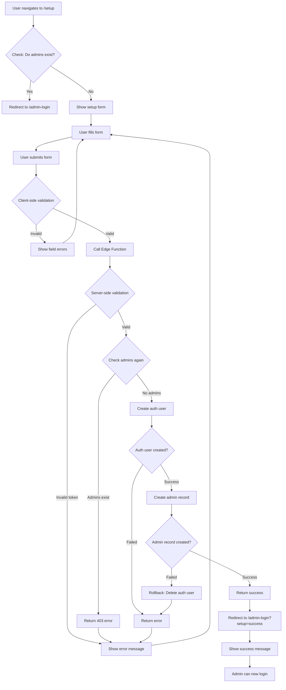
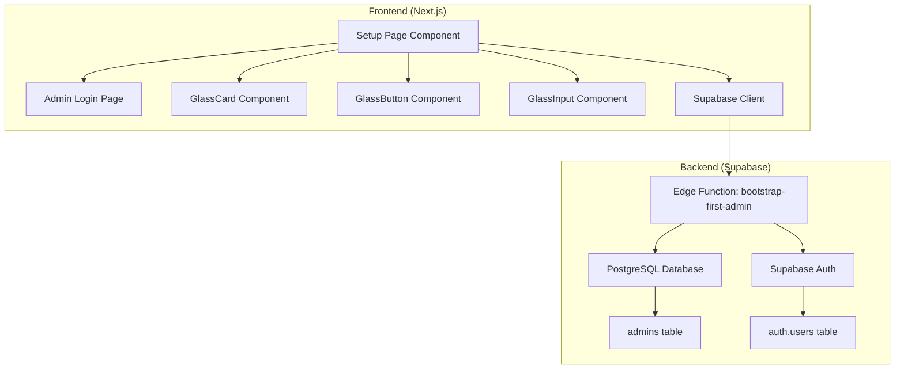
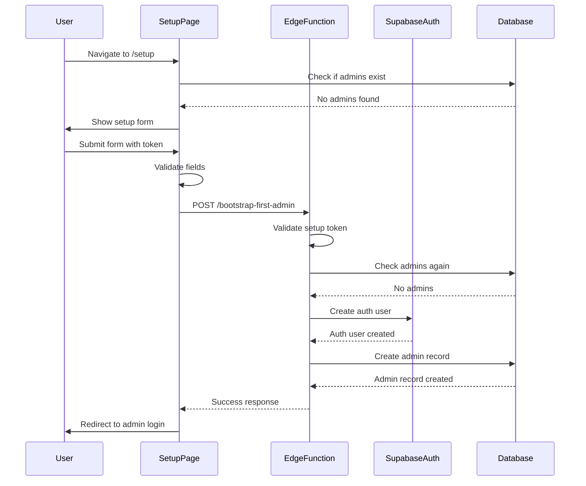
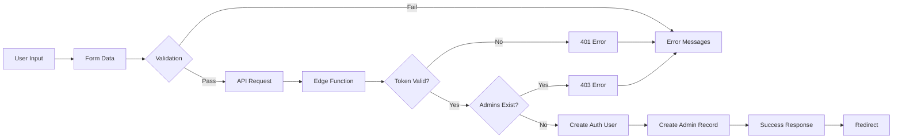
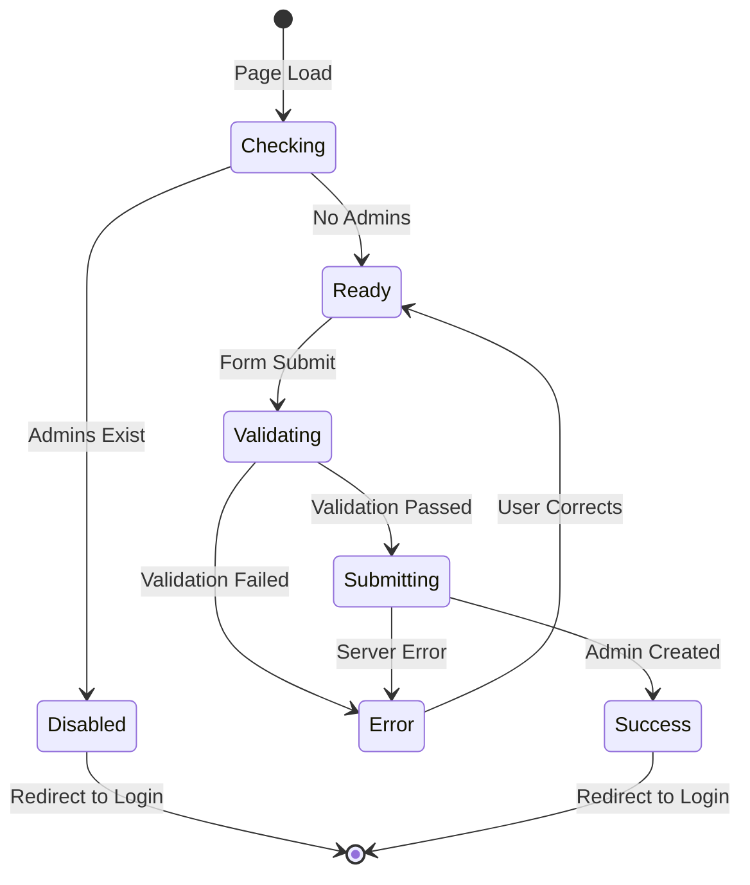
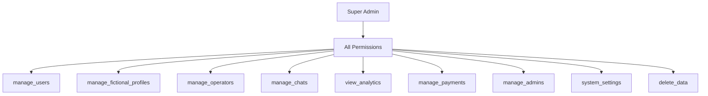
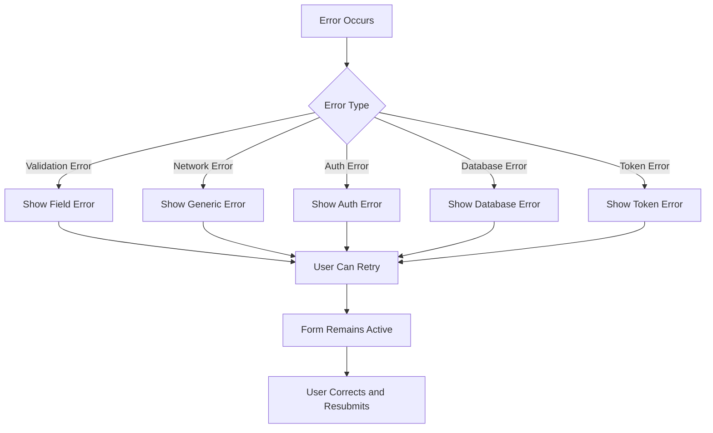
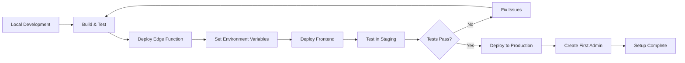

# Admin Setup Flow Diagram

## User Flow

## Component Architecture

## Security Flow

## Data Flow

## State Management

## Permission Structure

## Error Handling Flow

## Deployment Flow

